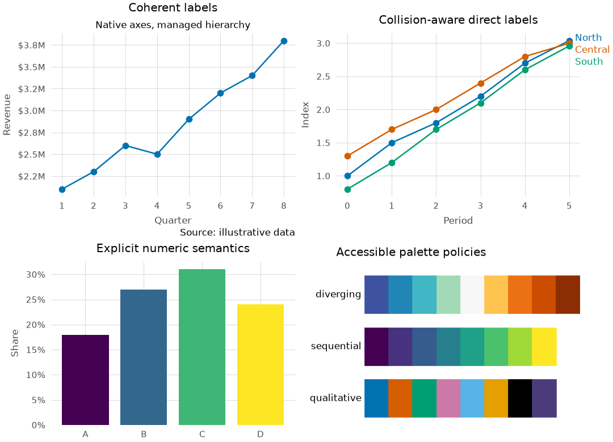
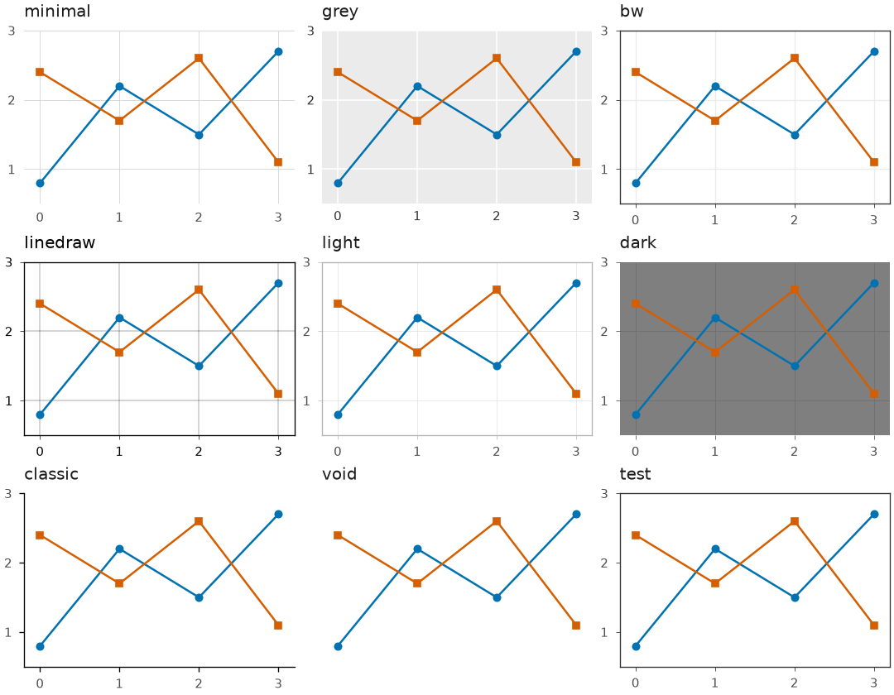

Gallery
========

Every image on this page is generated from
:download:`examples/finishing_gallery.py <../../examples/finishing_gallery.py>`. The
documentation and release jobs execute the source in a temporary directory, while
``python tools/validate_gallery.py --write`` deliberately refreshes the reviewed assets.

Publication finishing
----------------------

The publication-finishing gallery combines coherent title hierarchy, explicit currency
and percentage semantics, collision-aware endpoint labels, and the public palette
policies. Every panel remains an ordinary Matplotlib ``Axes``.

Theme comparison
----------------

All nine themes share a type scale and qualitative cycle. Theme changes affect the
non-data surface while the plotted series keep their visual identity.

Executable source
-----------------

.. literalinclude:: ../../examples/finishing_gallery.py
   :language: python
   :caption: examples/finishing_gallery.py
