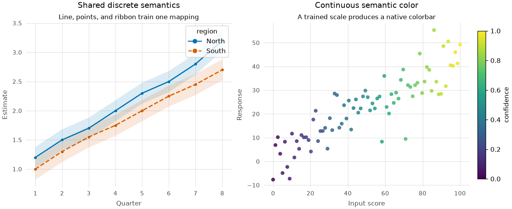

Semantic rendering gallery
==========================

This executable gallery combines the v0.5 semantic line, point, ribbon, scale, and
guide APIs. The layers return ordinary Matplotlib artists and share trained mappings
per axes. Automatic guides remain ordinary native legends and colorbars.

The result of every renderer also implements :class:`ggstyle.RenderedResult`. Its
``as_dict()`` and ``describe()`` methods provide bounded inspection data without
serializing live Matplotlib objects.

Executable source
-----------------

.. literalinclude:: ../../examples/semantic_gallery.py
   :language: python
   :caption: examples/semantic_gallery.py
